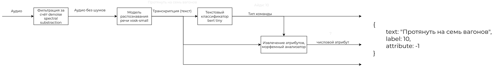

# Интеллектуальный пульт составителя

## Содержимое

- [Описание задачи](#описание-задачи)
- [Архитектура решения](#архитектура-решения)
- [Метрики](#метрики)
- [Файловая структура](#файловая-структура)
- [Развёртывание](#развёртывание)
- [Расширение команд](#расширение-команд)

## Описание задачи

При работе с беспилотными локомативами присутствуют сценарии когда сенсоры не могут эффективно оценивать происходящее, например при надвиге большого состава, в таких ситуациях нужна помощь составителя поездов.

Составитель должен отдавать **голосовые команды** беспилотному локомотиву.

Команды распознаются специальным пультом составителя с **жёсткими ограничениями** по ресурсам.

Необходимо разработать систему распознавания голосовых команд в соответствии со следующими критериями:
- До 1 ГБ ОЗУ
- ~100, <500мс на обработку аудио
- Защита от случайного нажатия
- Извлечение числовых 

## Архитектура решения



Модель VOSK поддерживает адаптацию для добавления новых команд 

## Метрики

| Показатель | значение |
| :-: | :-: |
| F1 взвешенная | 0.916 |
| WER | 0.228 |
| Задержка (для 1-й секунды) | 50 мс |
| Потребление ОЗУ | 740 МБ |

Оборудование: 11th Gen Intel(R) Core(TM) i5-11400H @ 2.70GHz

#### Описание выборки

| Всего | 1468 файлов |
| :-: | :-: |
| hr_bot_noise | 80% |
| hr_bot_clear | 80% |
| hr_bot_synt | 80% |
| luga | 50% |

Датасет данной выборки представлен в папке `./validation`

Результаты - в файле `./validation/validation_data_with_transcriptions.csv`

Обучающий датасет доступен по [ссылке тут](https://lodmedia.hb.bizmrg.com/case_files/1144817/train_dataset_train_rzhd_pult.zip) [или тут](https://datasets.vniias.ru/tasks/1)

Также данный датасет можно скачать с помощью скрипта `./utils/get_datasets.sh`

## Файловая структура

```bash
.
├── adaptate_vosk - Адаптирование модели VOSK
├── bert_extra - Модель BERT tiny
├── get_submission.py - финальный pipiline (1/2 файл)
├── model.py - финальный pipiline (2/2 файл)
├── images - картинки
├── models
│   ├── bert_extra.zip - без случайного срабатывания
│   ├── bert_noised.zip - финальная версия
│   └── vosk-model-small-ru-0.22.zip - аудио2текст
├── notebooks - Обучение, ipynb файлы
│   ├── generated.csv
│   ├── trans_text_all.csv
│   ├── Порождение_аугментированных_команд.csv
│   └── Обучение_BERT_классификатора.ipynb
├── poetry.lock
├── pyproject.toml
├── README.md
├── requirements.txt
├── settings.py - Настройки, можно выбрать модель берта и vosk
├── utils
│   ├── get_datasets.sh - скачать обучающий датасет
│   └── unpack_models.sh - распаковать модели
├── validation - выборка, на которой производилась валидация (все метрики по ней)
│   ├── new_folder_with_audios.zip
│   └── validation_data_with_transcriptions.csv
└── vosk-model-small-ru-0.22 - модель VOSK (аудио2текст)
```

Линия обработки находится в файлах get_


## Развёртывание

1. Клонирование репозитория

`git clone https://github.com/Papr1ka/int_console.git`

`cd ./int_console`

Клонирование происходит вместе с весами, необходимо какое-то время подождать (порядка 400-500 МБ суммарно).

2. Распакуйте модели в текущую директорию

`./utils/unpack_models.sh`

> Если вы на windows, можете разархивировать вручную, главное организуйте файлы в соответствии со [структурой выше](#файловая-структура)

3. Установите зависимости

`poetry install`

4. Используйте!

`poetry run python get_submission.py --src {путь до папки с аудио} --dst {путь до папки с будущим результатом}`

Пример:

Можно скачать обучающий датасет:

`./utils/get_datasets.sh`

Чтобы получить предсказания на валидационной выбрке:

`unzip validation/new_folder_with_audios.zip`

`poetry run python get_submission.py --src ./new_folder_with_audios/ --dst .`

### Расширение команд

Чтобы адаптировать модель VOSK, посетите [эту страницу](adaptate_vosk/README.md)
